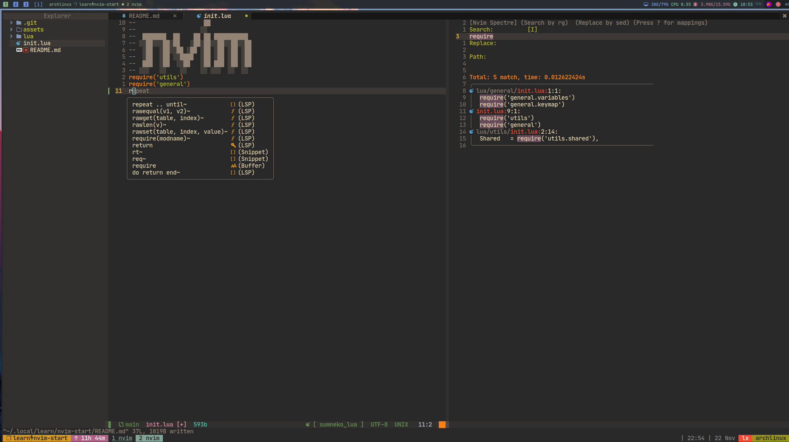
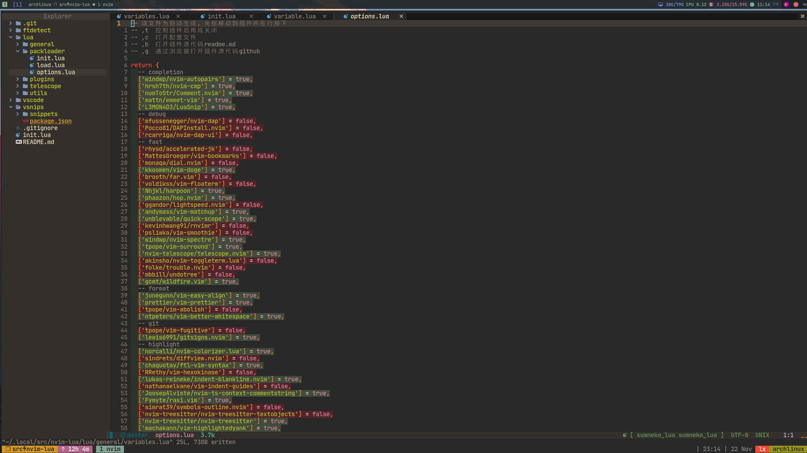

# nvim-start

这是一个用`lua`组织的`noevim`模块化配置非常适合前端开发，把我使用vim一些经验整理git教程
根据 git commit 一步步学习 [commits](https://github.com/Nhjkl/nvim-start/commits/main)  ，
配置文件的搭建过程，包含设置，快捷键，插件模块式管理，启动时间优化, tmux
结合，和终端下一些命令的结合， 持续更新中...

## feature
[feature](./docs/todo.md)

## 先来一张成品图




小白用户可能需要先了解一些基础知识，推荐一些学习资料

[w3cschool vim](https://www.w3cschool.cn/vim/)

[nvim-lua-guide-zh](https://github.com/glepnir/nvim-lua-guide-zh)

> 由于本人使用的arch linux，所以该配置目前考虑在linux良好运行

[noevim 安装](./docs/neovim_install.md)

## 配置文件安装
> noevim 的配置文件在 /home/[username]/.config/nvim
### 提供两种安装方式
1. 直接将clone配置文件位置

```bash
cd ~/.config/

# 如果`~/.config` 目录已有nvim文件夹,可以先做过备份 `mv nvim nvim.bk`

git clone https://github.com/Nhjkl/nvim-start.git nvim
```
2. 使用软链接, 已我的安装路径为例:
```bash
cd ~/.local/src/

git clone https://github.com/Nhjkl/nvim-start.git

# 如果`~/.config` 目录已有nvim文件夹,可以先做过备份 `mv nvim nvim.bk`

ln -s ~/.local/src/nvim-start ~/.config/nvim

# 执行 nvim 打开neovim 可验证配置效果
nvim
```

## 快捷键

`lua/general/keymap.lua`

[shortcuts](./docs/keymap.md)

## 插件安装

>结合 https://github.com/wbthomason/packer.nvim

>查看 [commmit](https://github.com/Nhjkl/nvim-start/commit/b9545f1a58f800c0e42fe592f4e6b343640a27ab)

>添加插件文件后执行 `:PackerInstall` `:PackerCompile`
