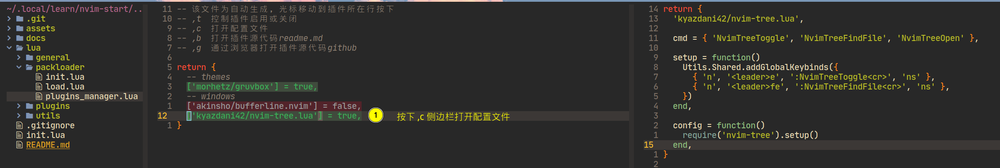

- [x] 启动自安装packer.nvim
- [x] 插件模块化管理
- [x] 生成插件管理文件 `lua/packloader/plugins_manager.lua`, 管理已安装的插件
- [x] 为`plugins_manager.lua` 文件添加快捷键，高亮显示

- [ ] 处理通用插件按需加载如 `nvim-web-devicons`
- [ ] 添加自动补全插件
- [ ] 添加lsp插件
